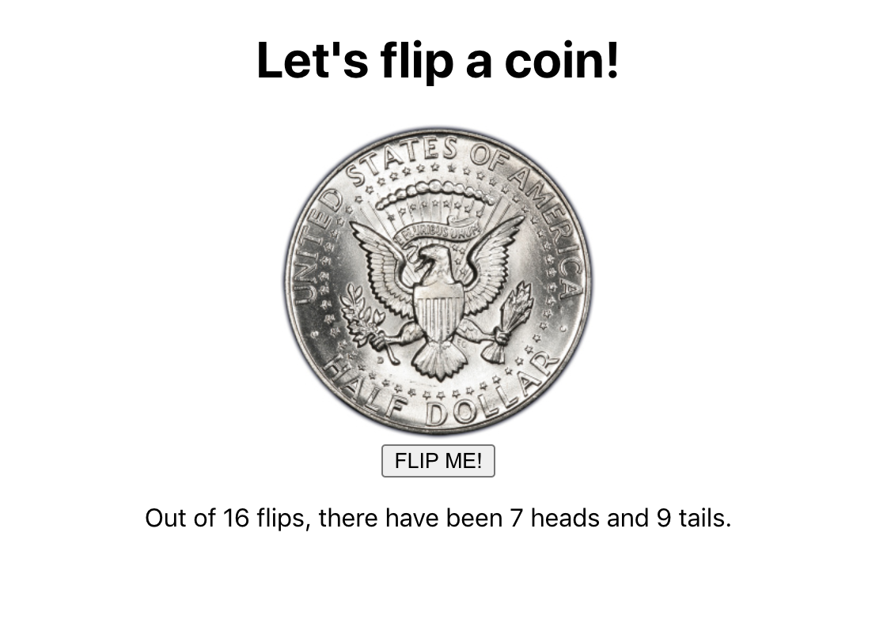

# Coin Flipper

### Description

This project aims to practice working with props, defaultProps, state, and simple click events in React and to gain more experience setting state and binding event handlers.

The goal is to create a Coin Flipper application that flips a coin when clicking and keeps track of the number of flips and the number of heads and tails.

It displays an interface that looks like this:

### Technologies

*Languages:* Javascript, HTML, CSS

*Library:* React

### Key features

* Flips a coin when clicking
* Keeps track of the number of flips and the number of heads and tails

### Poject status

The project is done.

### Credits & Sources

* Heads coin image from [this source](https://tinyurl.com/react-coin-heads-jpg)

* Tails coin image from [this source](https://tinyurl.com/react-coin-tails-jpg)
  
* Another small project from [The Modern React Bootcamp](https://www.udemy.com/course/modern-react-bootcamp)
